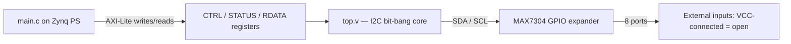

# MAX7304 I2C Port Monitor

FPGA project for the Digilent Zybo Z7 (Zynq-7000): a hand-written I2C
master in Verilog, wrapped as an AXI-Lite IP, driven from C over the
Zynq PS to monitor 8 GPIO ports on a MAX7304 I2C expander.

## Hardware

*(photo of Zybo + MAX7304 breakout here)*

MAX7304 address assumed `AD0 = GND` → 7-bit address `0x1C` (write `0x38`,
read `0x39`). SDA/SCL require external pull-ups (open-drain bus).

## Files

| File | Description |
|------|-------------|
| `top.v` | I2C bit-bang master core (START/WRITE/READ/STOP), AXI-controlled |
| `myip_iic_ela_v1_0.v` | AXI wrapper top-level |
| `myip_iic_ela_v1_0_S00_AXI.v` | AXI-Lite register interface |
| `zybo_i2c.xdc` | Pin constraints |
| `main.c` | Vitis/SDK app: configures MAX7304, prompts for ports, reports open ports |
| `i2c_tb.v` | Testbench + behavioral MAX7304 model |

## Architecture



All sequencing (device enable, direction config, register read/write,
repeated START) is done in C — `top.v` only exposes four primitive
operations (`START`, `WRITE`, `READ`, `STOP`) via registers.

## AXI register map (offset from IP base address)

| Offset | Name  | Access | Description |
|--------|-------|--------|-------------|
| 0x00   | CTRL  | W      | `[1:0]`=op_type, `[9:2]`=wr_data, `[10]`=send_nack. Writing triggers the operation. |
| 0x04   | STATUS | R     | Bit 0: operation done. |
| 0x08   | RDATA | R      | Last byte read from the bus. |

`op_type`: `0`=START, `1`=WRITE, `2`=READ, `3`=STOP.

## C usage

`main.c` enables the MAX7304's GPIOs, prompts (over UART) which ports to
configure as inputs, then reads back and reports which of those ports
currently read high (i.e. connected to VCC).

## Build

1. Package `top.v` inside the AXI-Lite wrapper (`myip_iic_ela`) and add
   it to the IP repository.
2. In a Block Design, instantiate the IP alongside the Zynq7 Processing
   System, run Block/Connection Automation, validate, create the HDL
   wrapper.
3. Apply `zybo_i2c.xdc`, generate bitstream, export hardware with
   bitstream.
4. In Vitis/SDK, create a standalone application, add `main.c`, build
   and run on hardware.

## Simulation

`i2c_tb.v` drives `top.v` through a config write and a repeated-start
read against a minimal behavioral MAX7304 model (`max7304_model`, in the
same file), verifying START/STOP/ACK timing and byte transfer.

```bash
iverilog -o sim i2c_tb.v top.v
vvp sim
```
